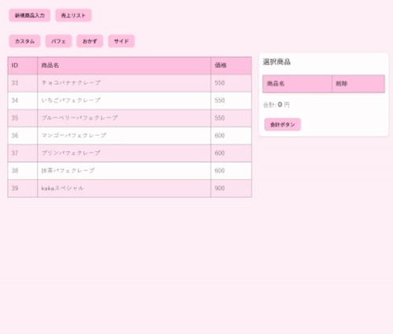

# ポートフォリオ紹介

クレープ屋で使うことを想定した簡易POSシステムです。
データはMySQLに保存され、端末単体で動作可能です。
本プロジェクトは、設計および HTML マークアップは自分で作成し、
JavaScript と CSS の実装には AI のサポートを利用しています。

#### デモ
)

#### 機能一覧

1.商品管理

　・商品情報の登録(商品名,カテゴリ,価格)

　・商品情報の削除

2.会計処理

　・商品の選択

　・合計金額の計算

　・会計データの保存

　・会計の取り消し

3.売上集計

　・売上一覧の表示

　・売上情報の削除

#### 技術構成
| 項目           | 使用技術               |
|----------------|----------------------|
| フロントエンド | HTML, CSS, JavaScript |
| バックエンド   | Node.js, Express      |
| データベース   | MySQL                 |

